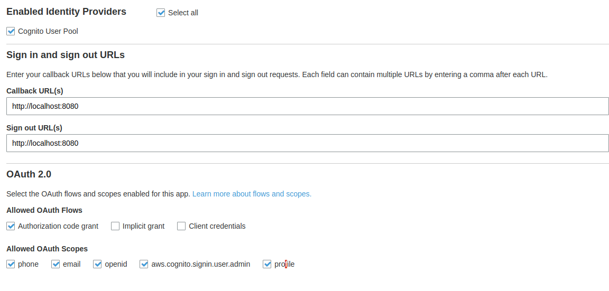

# Amplify Auth with Cognito Hosted UI

This is a simple example of using the Amplify JS library with vanilla JavaScript and the Cognito Hosted UI. You can use this with extisting resources by configuring Amplify as outlined in the [guide](https://docs.amplify.aws/lib/auth/start/q/platform/js/#re-use-existing-authentication-resource). Ensure you add the `oauth` block to the configuration as shown in the documentation, these are the settings that will be used to redirect/back from the hosted UI. See configuration image below, make sure you have the web client configured properly.

Or use the Amplify CLI:

```
amplify init
amplify add auth #choose default anything
amplify push
```

Choose any default option, or walk through the configuration. Ultimately you'll need the web client in Cognito User Pools to be configured with redirect_urls that match your config.

Get to to the console with `amplify auth console` choose "User Pools", then goto "Domain name" and add any domain name. Next, goto App client settings, and configure as such (make sure the App Client ID matches the one generated in your `src/aws-exports.js` file):



Save your configuration, return to your app and update the `src/app.js` file to include your domain name in the `authenticate()` function. Then run `npm start` click `sign in` and you should be redirected to the hosted ui.